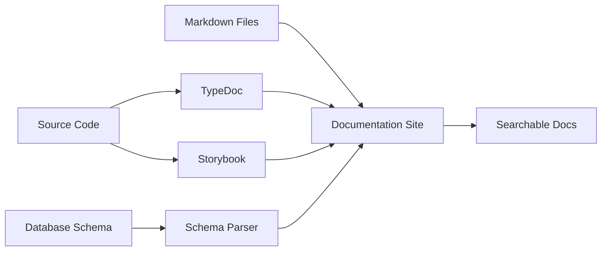

# Design Document: Comprehensive Documentation System

## Overview

This design document outlines the implementation of a comprehensive documentation system for Portal Guru. The system will include API documentation, component documentation (Storybook), architecture documentation, contributing guidelines, deployment guides, and troubleshooting guides. The documentation will be automatically generated where possible, easily searchable, and include visual aids to improve comprehension.

The documentation system will be built using industry-standard tools:
- **TypeDoc** for API documentation generation from TypeScript
- **Storybook** for interactive component documentation
- **Markdown** files for guides and architecture documentation
- **Mermaid** for diagrams
- **Algolia DocSearch** or local search for documentation search functionality

## Architecture

### Documentation Structure

```
docs/
├── api/                          # API Documentation
│   ├── database/                 # Database schema docs
│   │   ├── tables.md
│   │   ├── functions.md
│   │   └── types.md
│   ├── services/                 # Service layer docs
│   │   ├── supabase.md
│   │   ├── gamification.md
│   │   ├── pdf-generator.md
│   │   └── offline-queue.md
│   └── hooks/                    # Custom hooks docs
│       ├── useAuth.md
│       ├── useOfflineStatus.md
│       └── useSyncQueue.md
├── architecture/                 # Architecture Documentation
│   ├── overview.md
│   ├── data-flow.md
│   ├── security.md
│   ├── offline-sync.md
│   └── diagrams/
│       ├── system-architecture.mmd
│       ├── data-flow.mmd
│       └── auth-flow.mmd
├── components/                   # Component documentation (Storybook)
│   └── .storybook/
│       ├── main.ts
│       ├── preview.ts
│       └── theme.ts
├── guides/                       # User guides
│   ├── contributing.md
│   ├── deployment.md
│   ├── troubleshooting.md
│   ├── getting-started.md
│   └── testing.md
└── README.md                     # Documentation index
```

### Documentation Generation Pipeline



### Technology Stack

- **TypeDoc**: Generate API documentation from TypeScript source code
- **Storybook 7+**: Interactive component documentation
- **Docusaurus** or **VitePress**: Documentation site generator
- **Mermaid**: Diagram generation
- **JSDoc**: Inline code documentation
- **Supabase CLI**: Database schema export

## Components and Interfaces

### 1. API Documentation Generator

**Purpose**: Automatically generate API documentation from TypeScript source code and database schema.

**Interface**:
```typescript
interface ApiDocGenerator {
  generateFromSource(sourcePath: string): Promise<ApiDocumentation>;
  generateFromSchema(schemaPath: string): Promise<DatabaseDocumentation>;
  exportToMarkdown(docs: ApiDocumentation, outputPath: string): Promise<void>;
}

interface ApiDocumentation {
  services: ServiceDoc[];
  hooks: HookDoc[];
  utilities: UtilityDoc[];
}

interface ServiceDoc {
  name: string;
  description: string;
  functions: FunctionDoc[];
  dependencies: string[];
}

interface FunctionDoc {
  name: string;
  description: string;
  parameters: ParameterDoc[];
  returnType: string;
  examples: CodeExample[];
  throws?: string[];
}

interface DatabaseDocumentation {
  tables: TableDoc[];
  functions: RpcFunctionDoc[];
  types: TypeDoc[];
}

interface TableDoc {
  name: string;
  description: string;
  columns: ColumnDoc[];
  relationships: RelationshipDoc[];
  indexes: IndexDoc[];
}
```

### 2. Storybook Configuration

**Purpose**: Provide interactive component documentation with live examples.

**Configuration**:
```typescript
// .storybook/main.ts
import type { StorybookConfig } from '@storybook/react-vite';

const config: StorybookConfig = {
  stories: ['../src/**/*.stories.@(js|jsx|ts|tsx|mdx)'],
  addons: [
    '@storybook/addon-links',
    '@storybook/addon-essentials',
    '@storybook/addon-interactions',
    '@storybook/addon-a11y',
    '@storybook/addon-docs',
  ],
  framework: {
    name: '@storybook/react-vite',
    options: {},
  },
  docs: {
    autodocs: 'tag',
  },
};

export default config;
```

**Story Template**:
```typescript
import type { Meta, StoryObj } from '@storybook/react';
import { Button } from './Button';

const meta: Meta<typeof Button> = {
  title: 'UI/Button',
  component: Button,
  tags: ['autodocs'],
  argTypes: {
    variant: {
      control: 'select',
      options: ['default', 'destructive', 'outline', 'ghost'],
    },
    size: {
      control: 'select',
      options: ['default', 'sm', 'lg', 'icon'],
    },
  },
};

export default meta;
type Story = StoryObj<typeof Button>;

export const Default: Story = {
  args: {
    children: 'Button',
    variant: 'default',
  },
};

export const Destructive: Story = {
  args: {
    children: 'Delete',
    variant: 'destructive',
  },
};
```

### 3. Documentation Site Generator

**Purpose**: Generate a searchable, navigable documentation website.

**Interface**:
```typescript
interface DocSiteGenerator {
  build(config: DocSiteConfig): Promise<void>;
  serve(port: number): Promise<void>;
  search(query: string): Promise<SearchResult[]>;
}

interface DocSiteConfig {
  title: string;
  description: string;
  logo: string;
  navigation: NavigationItem[];
  searchConfig: SearchConfig;
  theme: ThemeConfig;
}

interface NavigationItem {
  label: string;
  path: string;
  children?: NavigationItem[];
}

interface SearchConfig {
  provider: 'algolia' | 'local';
  indexName?: string;
  apiKey?: string;
}
```

### 4. JSDoc Template System

**Purpose**: Provide consistent inline documentation format.

**Template**:
```typescript
/**
 * Brief description of the function
 * 
 * Detailed description explaining what the function does,
 * when to use it, and any important considerations.
 * 
 * @param paramName - Description of the parameter
 * @param optionalParam - Description of optional parameter
 * @returns Description of what the function returns
 * @throws {ErrorType} Description of when this error is thrown
 * 
 * @example
 * ```typescript
 * const result = functionName(param1, param2);
 * console.log(result);
 * ```
 * 
 * @see {@link RelatedFunction} for related functionality
 * @since 1.0.0
 * @deprecated Use {@link NewFunction} instead
 */
function functionName(paramName: string, optionalParam?: number): ReturnType {
  // Implementation
}
```

## Data Models

### Documentation Metadata

```typescript
interface DocumentationMetadata {
  version: string;
  lastUpdated: Date;
  contributors: string[];
  coverage: CoverageStats;
}

interface CoverageStats {
  totalFunctions: number;
  documentedFunctions: number;
  totalComponents: number;
  documentedComponents: number;
  coveragePercentage: number;
}

interface SearchIndex {
  id: string;
  title: string;
  content: string;
  type: 'api' | 'component' | 'guide' | 'architecture';
  path: string;
  tags: string[];
  lastModified: Date;
}
```

## Correctness Properties

*A property is a characteristic or behavior that should hold true across all valid executions of a system-essentially, a formal statement about what the system should do. Properties serve as the bridge between human-readable specifications and machine-verifiable correctness guarantees.*

### Property 1: Documentation completeness

*For any* public function, class, or component in the codebase, it should have corresponding JSDoc documentation with at minimum a description, parameter types, and return type.

**Validates: Requirements 2.4, 7.1, 7.4**

### Property 2: Documentation synchronization

*For any* TypeScript interface or type definition, when it changes, the generated API documentation should reflect those changes after regeneration.

**Validates: Requirements 8.1, 8.2, 8.3**

### Property 3: Example code validity

*For any* code example in documentation, it should be syntactically valid TypeScript that type-checks successfully.

**Validates: Requirements 2.3, 7.3**

### Property 4: Link integrity

*For any* internal link in documentation, the target document or section should exist and be accessible.

**Validates: Requirements 6.5**

### Property 5: Search result relevance

*For any* search query, all returned results should contain the search term or semantically related terms in their title or content.

**Validates: Requirements 9.1, 9.2**

### Property 6: Component story completeness

*For any* UI component with props, there should exist at least one Storybook story demonstrating each variant or major prop combination.

**Validates: Requirements 3.2, 3.3**

### Property 7: Diagram validity

*For any* Mermaid diagram in documentation, it should render without syntax errors and accurately represent the described system.

**Validates: Requirements 10.1, 10.3, 10.4**

### Property 8: Environment variable documentation

*For any* environment variable used in the codebase, it should be documented in the deployment guide with description and example value.

**Validates: Requirements 5.2**

### Property 9: Troubleshooting coverage

*For any* error message or exception thrown in the application, there should be a corresponding entry in the troubleshooting guide or the error should be self-explanatory.

**Validates: Requirements 6.1, 6.3**

### Property 10: Documentation accessibility

*For any* documentation page, it should be accessible via the navigation menu or search functionality within 3 clicks from the homepage.

**Validates: Requirements 9.1, 9.4**

## Error Handling

### Documentation Generation Errors

1. **Missing JSDoc Comments**
   - Detection: Scan source files for exported functions without JSDoc
   - Handling: Generate warning report with file locations
   - Recovery: Provide template JSDoc comments

2. **Invalid Mermaid Syntax**
   - Detection: Parse Mermaid diagrams during build
   - Handling: Fail build with clear error message
   - Recovery: Provide syntax validation tool

3. **Broken Links**
   - Detection: Crawl all documentation links during build
   - Handling: Generate error report with broken link locations
   - Recovery: Suggest similar valid links

4. **Outdated Examples**
   - Detection: Run TypeScript compiler on example code
   - Handling: Mark examples as outdated in documentation
   - Recovery: Provide automated example update suggestions

### Search Errors

1. **Search Index Corruption**
   - Detection: Validate search index integrity on startup
   - Handling: Rebuild search index from source
   - Recovery: Cache previous valid index as backup

2. **Search Service Unavailable**
   - Detection: Health check on search service
   - Handling: Fall back to basic text search
   - Recovery: Display degraded service notice

## Testing Strategy

### Unit Testing

**Documentation Generator Tests**:
- Test JSDoc parsing from source files
- Test Markdown generation from parsed documentation
- Test schema parsing from Supabase exports
- Test link validation logic
- Test search indexing logic

**Example**:
```typescript
describe('ApiDocGenerator', () => {
  it('should extract JSDoc from function', () => {
    const source = `
      /**
       * Adds two numbers
       * @param a First number
       * @param b Second number
       * @returns Sum of a and b
       */
      function add(a: number, b: number): number {
        return a + b;
      }
    `;
    
    const docs = generator.parseSource(source);
    expect(docs.functions[0].name).toBe('add');
    expect(docs.functions[0].parameters).toHaveLength(2);
  });
});
```

### Property-Based Testing

We will use **fast-check** for property-based testing in TypeScript.

**Property Test 1: Documentation Completeness**
```typescript
import fc from 'fast-check';

describe('Documentation Completeness Property', () => {
  it('all public exports should have JSDoc', () => {
    fc.assert(
      fc.property(
        fc.array(fc.record({
          name: fc.string(),
          isExported: fc.boolean(),
          hasJSDoc: fc.boolean(),
        })),
        (functions) => {
          const publicFunctions = functions.filter(f => f.isExported);
          const documented = publicFunctions.filter(f => f.hasJSDoc);
          
          // Property: All public functions must be documented
          return documented.length === publicFunctions.length;
        }
      ),
      { numRuns: 100 }
    );
  });
});
```

**Property Test 2: Link Integrity**
```typescript
describe('Link Integrity Property', () => {
  it('all internal links should resolve to existing pages', () => {
    fc.assert(
      fc.property(
        fc.array(fc.record({
          page: fc.string(),
          links: fc.array(fc.string()),
        })),
        fc.set(fc.string()), // Set of existing pages
        (pages, existingPages) => {
          // Property: All links should point to existing pages
          return pages.every(page =>
            page.links.every(link => existingPages.has(link))
          );
        }
      ),
      { numRuns: 100 }
    );
  });
});
```

**Property Test 3: Search Relevance**
```typescript
describe('Search Relevance Property', () => {
  it('search results should contain query terms', () => {
    fc.assert(
      fc.property(
        fc.string({ minLength: 1 }), // Search query
        fc.array(fc.record({
          title: fc.string(),
          content: fc.string(),
        })), // Documents
        (query, documents) => {
          const results = searchEngine.search(query, documents);
          
          // Property: All results should contain the query term
          return results.every(result =>
            result.title.toLowerCase().includes(query.toLowerCase()) ||
            result.content.toLowerCase().includes(query.toLowerCase())
          );
        }
      ),
      { numRuns: 100 }
    );
  });
});
```

### Integration Testing

**Documentation Build Pipeline Test**:
- Test end-to-end documentation generation from source to published site
- Test search functionality with real documentation content
- Test Storybook build and component rendering
- Test documentation site navigation

**Example**:
```typescript
describe('Documentation Build Pipeline', () => {
  it('should generate complete documentation site', async () => {
    // Generate API docs
    await apiDocGenerator.generate('./src');
    
    // Build Storybook
    await storybookBuilder.build();
    
    // Build documentation site
    await docSiteGenerator.build();
    
    // Verify all expected pages exist
    expect(fs.existsSync('./docs/api/index.html')).toBe(true);
    expect(fs.existsSync('./docs/components/index.html')).toBe(true);
    expect(fs.existsSync('./docs/guides/contributing.html')).toBe(true);
  });
});
```

### Manual Testing

- Review generated documentation for accuracy and completeness
- Test search functionality with various queries
- Verify all diagrams render correctly
- Test documentation site on different browsers and devices
- Verify accessibility with screen readers

## Implementation Notes

### Phase 1: Foundation
1. Set up documentation structure
2. Configure TypeDoc for API documentation
3. Set up Storybook for component documentation
4. Create basic architecture documentation with Mermaid diagrams

### Phase 2: Content Creation
1. Add JSDoc comments to all public APIs
2. Create Storybook stories for all UI components
3. Write contributing guidelines
4. Write deployment guide
5. Create troubleshooting guide

### Phase 3: Automation
1. Set up automated documentation generation in CI/CD
2. Implement documentation coverage checks
3. Add link validation to CI pipeline
4. Set up automated Storybook deployment

### Phase 4: Search & Polish
1. Implement search functionality
2. Add visual aids (diagrams, screenshots)
3. Improve navigation and discoverability
4. Gather feedback and iterate

## Dependencies

- TypeDoc: ^0.25.0
- Storybook: ^7.6.0
- @storybook/react-vite: ^7.6.0
- @storybook/addon-a11y: ^7.6.0
- Docusaurus or VitePress: Latest
- Mermaid: ^10.0.0
- fast-check: ^3.15.0 (for property-based testing)
