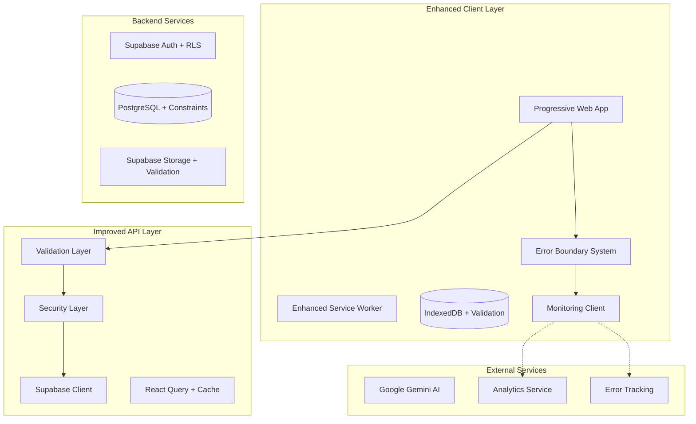

# Design Document - Portal Guru Improvements

## Overview

This design document outlines comprehensive improvements to the Portal Guru application to address identified gaps in error handling, security, code quality, performance, testing, monitoring, mobile experience, and data validation. The improvements will be implemented incrementally to minimize disruption while maximizing impact on application reliability and maintainability.

## Architecture

### Current Architecture Analysis

The Portal Guru application currently uses:
- **Frontend**: React 18 with TypeScript, Vite build tool
- **Backend**: Supabase (PostgreSQL, Auth, Storage)
- **State Management**: TanStack Query for server state
- **Styling**: Tailwind CSS with design system
- **PWA**: Vite PWA plugin with service worker

### Proposed Architecture Enhancements



## Components and Interfaces

### 1. Enhanced Error Handling System

#### Error Boundary Component
```typescript
interface ErrorBoundaryProps {
  fallback?: React.ComponentType<ErrorFallbackProps>;
  onError?: (error: Error, errorInfo: ErrorInfo) => void;
  children: React.ReactNode;
}

interface ErrorInfo {
  componentStack: string;
  errorBoundary?: string;
  errorBoundaryStack?: string;
}
```

#### Error Logger Service
```typescript
interface ErrorLogger {
  logError(error: Error, context?: ErrorContext): Promise<void>;
  logWarning(message: string, context?: ErrorContext): Promise<void>;
  logInfo(message: string, context?: ErrorContext): Promise<void>;
}

interface ErrorContext {
  userId?: string;
  component?: string;
  action?: string;
  metadata?: Record<string, any>;
}
```

### 2. Security Enhancement Layer

#### Input Validation Service
```typescript
interface ValidationService {
  validateInput<T>(data: unknown, schema: ZodSchema<T>): ValidationResult<T>;
  sanitizeHtml(input: string): string;
  validateFile(file: File): FileValidationResult;
}

interface ValidationResult<T> {
  success: boolean;
  data?: T;
  errors?: ValidationError[];
}
```

#### Security Audit Service
```typescript
interface SecurityAuditService {
  auditRequest(request: SecurityAuditRequest): SecurityAuditResult;
  checkRateLimit(endpoint: string, userId: string): RateLimitResult;
  validateSession(token: string): SessionValidationResult;
}
```

### 3. Performance Optimization Components

#### Virtual List Component
```typescript
interface VirtualListProps<T> {
  items: T[];
  itemHeight: number;
  containerHeight: number;
  renderItem: (item: T, index: number) => React.ReactNode;
  overscan?: number;
}
```

#### Image Optimization Service
```typescript
interface ImageOptimizationService {
  getOptimizedUrl(url: string, options: ImageOptions): string;
  preloadImage(url: string): Promise<void>;
  generatePlaceholder(width: number, height: number): string;
}
```

### 4. Testing Infrastructure

#### Test Utilities
```typescript
interface TestUtils {
  renderWithProviders(component: React.ReactElement): RenderResult;
  createMockUser(): MockUser;
  setupMockServer(): MockServer;
}

interface PropertyTestGenerator<T> {
  generate(): T;
  shrink(value: T): T[];
}
```

### 5. Monitoring and Analytics

#### Analytics Service
```typescript
interface AnalyticsService {
  trackEvent(event: AnalyticsEvent): void;
  trackPageView(page: string): void;
  trackError(error: Error): void;
  setUserProperties(properties: UserProperties): void;
}

interface PerformanceMonitor {
  measureWebVitals(): WebVitalsMetrics;
  trackApiPerformance(endpoint: string, duration: number): void;
  reportPerformanceMetrics(): void;
}
```

## Data Models

### Enhanced Error Model
```typescript
interface ErrorRecord {
  id: string;
  timestamp: Date;
  level: 'error' | 'warning' | 'info';
  message: string;
  stack?: string;
  context: ErrorContext;
  userId?: string;
  sessionId: string;
  userAgent: string;
  url: string;
}
```

### Security Audit Model
```typescript
interface SecurityAuditLog {
  id: string;
  timestamp: Date;
  userId?: string;
  action: string;
  resource: string;
  result: 'allowed' | 'denied' | 'suspicious';
  riskLevel: 'low' | 'medium' | 'high';
  metadata: Record<string, any>;
}
```

### Performance Metrics Model
```typescript
interface PerformanceMetrics {
  id: string;
  timestamp: Date;
  userId?: string;
  page: string;
  metrics: {
    fcp: number; // First Contentful Paint
    lcp: number; // Largest Contentful Paint
    fid: number; // First Input Delay
    cls: number; // Cumulative Layout Shift
    ttfb: number; // Time to First Byte
  };
  deviceInfo: DeviceInfo;
}
```

### Validation Schema Models
```typescript
// Student validation schema
const StudentSchema = z.object({
  name: z.string().min(2).max(100).regex(/^[a-zA-Z\s]+$/),
  gender: z.enum(['Laki-laki', 'Perempuan']),
  class_id: z.string().uuid(),
  parent_phone: z.string().regex(/^(\+62|62|0)8[1-9][0-9]{6,9}$/).optional(),
  access_code: z.string().length(6).regex(/^[A-Z0-9]{6}$/).optional()
});

// Attendance validation schema
const AttendanceSchema = z.object({
  student_id: z.string().uuid(),
  date: z.string().regex(/^\d{4}-\d{2}-\d{2}$/),
  status: z.enum(['Hadir', 'Izin', 'Sakit', 'Alpha']),
  notes: z.string().max(500).optional()
});
```

## Correctness Properties

*A property is a characteristic or behavior that should hold true across all valid executions of a system-essentially, a formal statement about what the system should do. Properties serve as the bridge between human-readable specifications and machine-verifiable correctness guarantees.*

### Property Reflection

After analyzing all acceptance criteria, several properties can be consolidated to eliminate redundancy:

- Properties 1.1-1.5 (error handling) can be combined into comprehensive error handling properties
- Properties 2.1-2.5 (security) can be grouped into input/output security properties  
- Properties 4.1-4.4 (performance) can be consolidated into performance optimization properties
- Properties 6.1-6.5 (monitoring) can be combined into comprehensive monitoring properties
- Properties 7.1-7.5 (mobile) can be grouped into mobile experience properties
- Properties 8.1-8.5 (data validation) can be consolidated into data integrity properties

### Error Handling Properties

**Property 1: Error Capture and Context**
*For any* error that occurs in the application, the error handling system should capture the error with complete context including stack trace, user ID, timestamp, and component information
**Validates: Requirements 1.1, 1.4**

**Property 2: Network Retry with Exponential Backoff**
*For any* failed network request, the retry mechanism should implement exponential backoff with increasing delays between attempts
**Validates: Requirements 1.2**

**Property 3: User-Friendly Error Display**
*For any* error displayed to users, the message should be user-friendly and not expose technical implementation details
**Validates: Requirements 1.3**

**Property 4: Application Crash Prevention**
*For any* critical error, the error boundary system should prevent application crashes and maintain application stability
**Validates: Requirements 1.5**

### Security Properties

**Property 5: Input Validation Completeness**
*For any* user input received by the system, it should be validated against defined Zod schemas before processing
**Validates: Requirements 2.1**

**Property 6: File Upload Security**
*For any* file uploaded to the system, it should be validated for type, size, and scanned for malicious content
**Validates: Requirements 2.2**

**Property 7: SQL Injection Prevention**
*For any* database query, the system should use parameterized queries to prevent SQL injection attacks
**Validates: Requirements 2.3**

**Property 8: XSS Prevention**
*For any* user data displayed in the UI, it should be sanitized to prevent cross-site scripting attacks
**Validates: Requirements 2.4**

**Property 9: Rate Limiting Protection**
*For any* API endpoint access, the system should enforce rate limiting to prevent abuse and ensure fair usage
**Validates: Requirements 2.5**

### Performance Properties

**Property 10: Image Optimization**
*For any* image loaded in the application, it should be lazy loaded and optimized for the appropriate size and format
**Validates: Requirements 4.1**

**Property 11: Large Dataset Virtualization**
*For any* large dataset rendered in lists or tables, the system should use virtualization to render only visible items
**Validates: Requirements 4.2**

**Property 12: API Caching Strategy**
*For any* API call made, the system should implement appropriate caching strategies using React Query
**Validates: Requirements 4.3**

**Property 13: Render Optimization**
*For any* component re-render, the system should prevent unnecessary renders using React.memo and useMemo where appropriate
**Validates: Requirements 4.4**

### Monitoring Properties

**Property 14: User Action Tracking**
*For any* user interaction with the application, the system should track the action for analytics purposes
**Validates: Requirements 6.1**

**Property 15: Performance Metrics Collection**
*For any* page load or interaction, the system should measure and report Core Web Vitals metrics
**Validates: Requirements 6.2**

**Property 16: Error Reporting**
*For any* error that occurs, the system should send error reports to monitoring services with appropriate context
**Validates: Requirements 6.3**

**Property 17: API Performance Monitoring**
*For any* API call made, the system should log response times and success rates for monitoring
**Validates: Requirements 6.4**

**Property 18: Offline Usage Tracking**
*For any* offline functionality usage, the system should track usage patterns for analysis
**Validates: Requirements 6.5**

### Mobile Experience Properties

**Property 19: Responsive Design**
*For any* screen size or device orientation, the application should provide appropriate responsive design
**Validates: Requirements 7.1**

**Property 20: PWA Offline Functionality**
*For any* PWA installation, the system should work offline with cached data and sync when connectivity is restored
**Validates: Requirements 7.2**

**Property 21: Touch Gesture Support**
*For any* mobile gesture input, the system should support appropriate touch interactions like swipe and pinch
**Validates: Requirements 7.3**

**Property 22: Push Notification Delivery**
*For any* important update or event, the system should send appropriate push notifications to users
**Validates: Requirements 7.4**

**Property 23: Mobile Keyboard Handling**
*For any* mobile keyboard appearance, the system should adjust layout to prevent content from being hidden
**Validates: Requirements 7.5**

### Data Integrity Properties

**Property 24: Client-Side Data Validation**
*For any* data entered by users, the system should validate data types and formats at the client level
**Validates: Requirements 8.1**

**Property 25: Database Constraint Enforcement**
*For any* data storage operation, the system should enforce database constraints and validation rules
**Validates: Requirements 8.2**

**Property 26: Data Synchronization Consistency**
*For any* data synchronization operation, the system should handle conflicts and maintain data consistency
**Validates: Requirements 8.3**

**Property 27: Export/Import Data Integrity**
*For any* data export or import operation, the system should ensure data integrity is maintained throughout the process
**Validates: Requirements 8.4**

**Property 28: Referential Integrity Maintenance**
*For any* operation involving data relationships, the system should maintain referential integrity across all operations
**Validates: Requirements 8.5**

## Error Handling

### Error Classification System

```typescript
enum ErrorSeverity {
  LOW = 'low',
  MEDIUM = 'medium',
  HIGH = 'high',
  CRITICAL = 'critical'
}

enum ErrorCategory {
  NETWORK = 'network',
  VALIDATION = 'validation',
  AUTHENTICATION = 'authentication',
  AUTHORIZATION = 'authorization',
  BUSINESS_LOGIC = 'business_logic',
  SYSTEM = 'system'
}
```

### Error Handling Strategy

1. **Client-Side Errors**
   - React Error Boundaries for component errors
   - Global error handlers for unhandled promises
   - Network error handling with retry logic
   - Validation error display in forms

2. **Server-Side Errors**
   - Supabase error handling and mapping
   - Database constraint error handling
   - Authentication/authorization error handling

3. **User Experience**
   - Toast notifications for non-critical errors
   - Modal dialogs for critical errors requiring user action
   - Inline validation messages for form errors
   - Fallback UI components for error states

### Recovery Mechanisms

1. **Automatic Recovery**
   - Network request retries with exponential backoff
   - Offline queue processing when connectivity restored
   - Cache invalidation and refetch on stale data

2. **User-Initiated Recovery**
   - Retry buttons for failed operations
   - Refresh options for stale data
   - Manual sync triggers for offline data

## Testing Strategy

### Dual Testing Approach

The testing strategy combines unit testing and property-based testing for comprehensive coverage:

**Unit Testing Requirements:**
- Unit tests verify specific examples, edge cases, and error conditions
- Integration points between components are tested
- Focus on concrete scenarios and expected behaviors
- Use React Testing Library for component testing
- Mock external dependencies appropriately

**Property-Based Testing Requirements:**
- Use fast-check library for property-based testing in TypeScript
- Configure each property-based test to run a minimum of 100 iterations
- Tag each property-based test with comments referencing the design document property
- Use format: `**Feature: portal-guru-improvements, Property {number}: {property_text}**`
- Each correctness property must be implemented by a single property-based test
- Generate smart test data that constrains to valid input spaces

**Testing Coverage Requirements:**
- Services and business logic: 80% minimum coverage
- Utility functions: 90% minimum coverage  
- React hooks: 80% minimum coverage
- UI components: 70% minimum coverage
- Integration tests for critical user flows
- Property-based tests for all data transformations and invariants

**Testing Tools:**
- **Vitest**: Primary test runner (Jest-compatible)
- **@testing-library/react**: Component testing utilities
- **fast-check**: Property-based testing library
- **MSW**: API mocking for integration tests
- **@vitest/coverage-v8**: Code coverage reporting