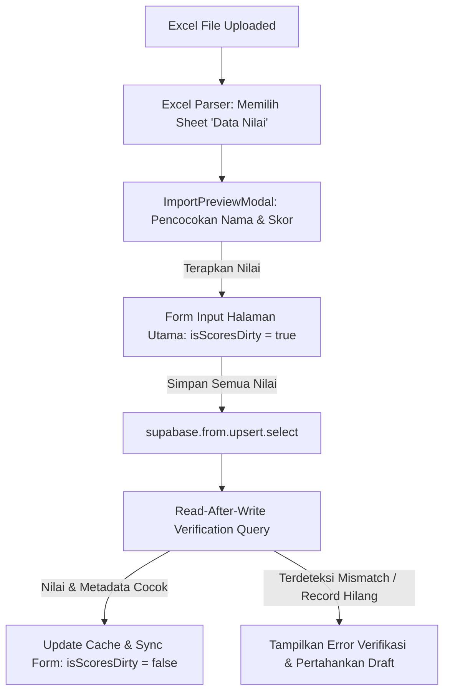

# Panduan Diagnosis & Pemecahan Masalah Impor Nilai

Dokumen ini menyediakan panduan teknis bagi administrator atau pengembang untuk melacak dan memecahkan masalah terkait sinkronisasi dan persistensi nilai akademik pada tabel `public.academic_records`.

---

## 1. Gejala Masalah
- Nilai berhasil terbaca dari Excel dan ditampilkan pada dialog konfirmasi kecocokan.
- Setelah menekan tombol **"Terapkan Nilai"**, nilai tampil di tabel input nilai cepat, tetapi setelah halaman dimuat ulang (*reload*) atau ketika membuka **Detail Siswa**, nilai tersebut hilang/tidak berubah.
- Hal ini disebabkan oleh perbedaan status data: alur "Terapkan Nilai" hanya memindahkan data ke React form state di sisi klien. Data baru benar-benar tersimpan ke database setelah menekan tombol **"Simpan Semua Nilai"** dan melewati verifikasi database (*read-after-write verification*).

---

## 2. Alur Penyimpanan Data



---

## 3. Query Diagnosis Database

### A. Memeriksa Kebijakan Row-Level Security (RLS)
Gunakan query SQL berikut untuk melihat seluruh kebijakan keamanan RLS aktif pada tabel `academic_records`:

```sql
select
  policyname,
  cmd,
  roles,
  qual,
  with_check
from pg_policies
where schemaname = 'public'
  and tablename = 'academic_records'
order by policyname;
```

Kebijakan yang benar untuk kolaborasi guru meliputi:
- `Teachers can read accessible academic records` (SELECT)
- `Teachers can update assigned academic records` (UPDATE)
- `Teachers can delete assigned academic records` (DELETE)

### B. Mendiagnosis Penugasan Guru (Teacher Assignments)
Untuk memastikan akun guru tertentu memiliki wewenang untuk mengisi nilai pada kelas, semester, dan mata pelajaran tertentu, jalankan query berikut:

```sql
select
  teacher_user_id,
  class_id,
  semester_id,
  assignment_role,
  subject_name,
  deleted_at
from public.teacher_class_assignments
where teacher_user_id = '<USER_ID>'
  and class_id = '<CLASS_ID>'
  and semester_id = '<SEMESTER_ID>';
```

*Ganti `<USER_ID>`, `<CLASS_ID>`, dan `<SEMESTER_ID>` dengan UUID aktual.*

### C. Memeriksa Hasil Penyimpanan Nilai
Untuk memverifikasi apakah data nilai siswa benar-benar tersimpan di database:

```sql
select
  id,
  student_id,
  user_id,
  subject,
  assessment_name,
  score,
  semester_id,
  created_at,
  deleted_at
from public.academic_records
where student_id = '<STUDENT_ID>'
  and semester_id = '<SEMESTER_ID>'
  and subject = '<SUBJECT>'
order by created_at desc;
```

---

## 4. Cara Menguji secara Lokal / Staging
1. Masuk (*login*) sebagai akun guru mata pelajaran yang memiliki tugas mengajar aktif.
2. Unduh template Excel langsung dari tombol **Template Excel** di halaman input nilai cepat.
3. Isikan beberapa baris nilai (uji pula nilai `0`, angka desimal berkoma seperti `85,5`, dan nilai normal `90`).
4. Klik **Import Excel**, pilih berkas tersebut, lalu periksa kecocokan siswa pada tabel pratinjau.
5. Klik **Terapkan Nilai**, verifikasi bahwa banner berwarna kuning bertuliskan **"Belum disimpan ke database"** muncul di layar.
6. Coba tutup halaman atau muat ulang browser, pastikan muncul dialog konfirmasi/peringatan dari browser bahwa data belum disimpan.
7. Klik **Simpan Semua Nilai**, verifikasi bahwa notifikasi sukses muncul dengan tulisan `X nilai tersimpan dan terverifikasi di database.`
8. Muat ulang halaman, pastikan nilai-nilai tersebut tetap tampil.
9. Buka halaman **Detail Siswa** untuk salah satu siswa yang diuji, pastikan tab nilai langsung diperbarui dengan nilai baru tersebut.
