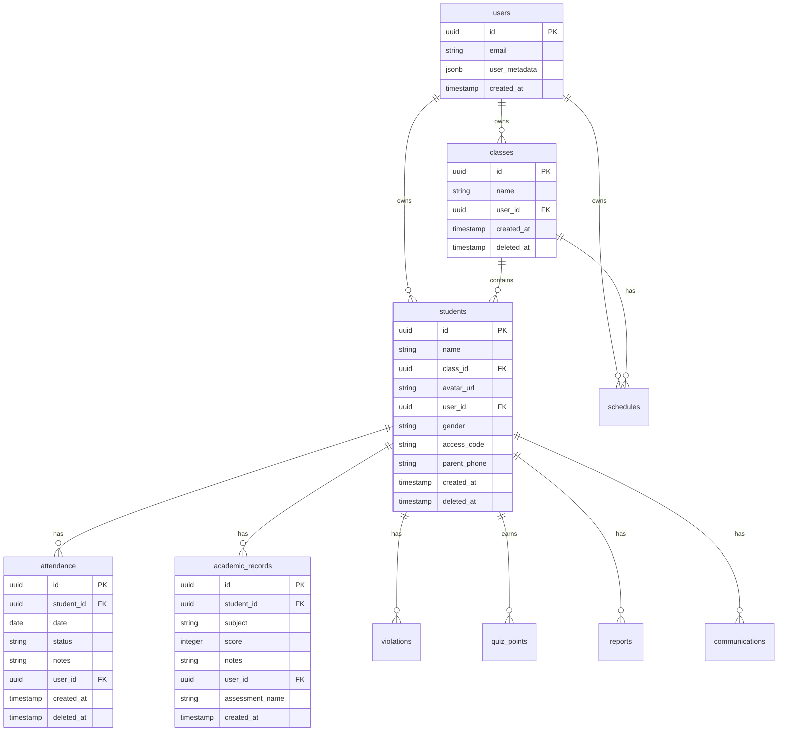

# Database Schema Documentation

Portal Guru menggunakan PostgreSQL via Supabase sebagai database backend. Dokumen ini menjelaskan struktur tabel, relasi, dan contoh query.

## Table of Contents

1. [Entity Relationship Diagram](#entity-relationship-diagram)
2. [Core Tables](#core-tables)
3. [Support Tables](#support-tables)
4. [Relationships](#relationships)
5. [Row Level Security](#row-level-security)
6. [Common Queries](#common-queries)

---

## Entity Relationship Diagram



---

## Core Tables

### `classes`

Menyimpan data kelas yang dikelola oleh guru.

| Column | Type | Nullable | Default | Description |
|--------|------|----------|---------|-------------|
| `id` | uuid | No | `uuid_generate_v4()` | Primary key |
| `name` | text | No | - | Nama kelas (e.g., "Kelas 5A") |
| `user_id` | uuid | No | - | FK ke auth.users, pemilik kelas |
| `created_at` | timestamptz | No | `now()` | Waktu pembuatan |
| `deleted_at` | timestamptz | Yes | null | Soft delete timestamp |

**Indexes:**
- `classes_pkey` - Primary key on `id`
- `classes_user_id_idx` - Index on `user_id`

---

### `students`

Menyimpan data siswa.

| Column | Type | Nullable | Default | Description |
|--------|------|----------|---------|-------------|
| `id` | uuid | No | `uuid_generate_v4()` | Primary key |
| `name` | text | No | - | Nama lengkap siswa |
| `class_id` | uuid | Yes | null | FK ke classes |
| `avatar_url` | text | No | - | URL foto profil |
| `user_id` | uuid | No | - | FK ke auth.users |
| `gender` | text | No | - | 'Laki-laki' atau 'Perempuan' |
| `access_code` | text | Yes | null | Kode akses untuk portal orang tua |
| `parent_phone` | text | Yes | null | Nomor telepon orang tua |
| `created_at` | timestamptz | No | `now()` | Waktu pembuatan |
| `deleted_at` | timestamptz | Yes | null | Soft delete timestamp |

**Indexes:**
- `students_pkey` - Primary key on `id`
- `students_user_id_idx` - Index on `user_id`
- `students_class_id_idx` - Index on `class_id`
- `students_access_code_idx` - Unique index on `access_code`

---

### `attendance`

Menyimpan rekam kehadiran siswa.

| Column | Type | Nullable | Default | Description |
|--------|------|----------|---------|-------------|
| `id` | uuid | No | `uuid_generate_v4()` | Primary key |
| `student_id` | uuid | No | - | FK ke students |
| `date` | date | No | - | Tanggal kehadiran |
| `status` | text | No | - | 'Hadir', 'Izin', 'Sakit', 'Alpha' |
| `notes` | text | Yes | null | Catatan tambahan |
| `user_id` | uuid | No | - | FK ke auth.users |
| `created_at` | timestamptz | No | `now()` | Waktu pembuatan |
| `deleted_at` | timestamptz | Yes | null | Soft delete timestamp |

**Indexes:**
- `attendance_pkey` - Primary key on `id`
- `attendance_student_id_date_idx` - Unique index on `(student_id, date)`

**Constraints:**
- UNIQUE on `(student_id, date)` - Satu siswa hanya bisa punya satu status per hari

---

### `academic_records`

Menyimpan nilai akademik siswa.

| Column | Type | Nullable | Default | Description |
|--------|------|----------|---------|-------------|
| `id` | uuid | No | `uuid_generate_v4()` | Primary key |
| `student_id` | uuid | No | - | FK ke students |
| `subject` | text | No | - | Mata pelajaran |
| `score` | integer | No | - | Nilai (0-100) |
| `notes` | text | No | '' | Catatan/deskripsi |
| `user_id` | uuid | No | - | FK ke auth.users |
| `assessment_name` | text | Yes | null | Nama penilaian (e.g., "UTS") |
| `created_at` | timestamptz | No | `now()` | Waktu pembuatan |

**Indexes:**
- `academic_records_pkey` - Primary key on `id`
- `academic_records_student_id_idx` - Index on `student_id`

---

### `tasks`

Menyimpan to-do list guru.

| Column | Type | Nullable | Default | Description |
|--------|------|----------|---------|-------------|
| `id` | uuid | No | `uuid_generate_v4()` | Primary key |
| `user_id` | uuid | No | - | FK ke auth.users |
| `title` | text | No | - | Judul tugas |
| `description` | text | Yes | null | Deskripsi |
| `due_date` | date | Yes | null | Tanggal deadline |
| `status` | text | No | 'todo' | 'todo', 'in_progress', 'done' |
| `created_at` | timestamptz | No | `now()` | Waktu pembuatan |
| `deleted_at` | timestamptz | Yes | null | Soft delete timestamp |

---

## Support Tables

### `violations`

Menyimpan catatan pelanggaran siswa.

| Column | Type | Nullable | Default | Description |
|--------|------|----------|---------|-------------|
| `id` | uuid | No | `uuid_generate_v4()` | Primary key |
| `student_id` | uuid | No | - | FK ke students |
| `date` | date | No | - | Tanggal pelanggaran |
| `description` | text | No | - | Deskripsi pelanggaran |
| `points` | integer | No | - | Poin pelanggaran |
| `user_id` | uuid | No | - | FK ke auth.users |
| `created_at` | timestamptz | No | `now()` | Waktu pembuatan |

---

### `quiz_points`

Menyimpan poin dari quiz dan aktivitas.

| Column | Type | Nullable | Default | Description |
|--------|------|----------|---------|-------------|
| `id` | serial | No | auto | Primary key |
| `quiz_name` | text | No | - | Nama quiz/aktivitas |
| `subject` | text | No | - | Mata pelajaran |
| `points` | integer | No | - | Poin yang diperoleh |
| `max_points` | integer | No | - | Poin maksimal |
| `quiz_date` | date | No | - | Tanggal quiz |
| `student_id` | uuid | No | - | FK ke students |
| `user_id` | uuid | No | - | FK ke auth.users |
| `created_at` | timestamptz | No | `now()` | Waktu pembuatan |

---

### `reports`

Menyimpan catatan/laporan harian siswa.

| Column | Type | Nullable | Default | Description |
|--------|------|----------|---------|-------------|
| `id` | uuid | No | `uuid_generate_v4()` | Primary key |
| `student_id` | uuid | No | - | FK ke students |
| `date` | date | No | - | Tanggal laporan |
| `title` | text | No | - | Judul laporan |
| `notes` | text | No | - | Isi laporan |
| `attachment_url` | text | Yes | null | URL lampiran |
| `user_id` | uuid | No | - | FK ke auth.users |
| `created_at` | timestamptz | No | `now()` | Waktu pembuatan |

---

### `action_history`

Menyimpan riwayat aksi untuk fitur undo.

| Column | Type | Nullable | Default | Description |
|--------|------|----------|---------|-------------|
| `id` | uuid | No | - | Primary key |
| `user_id` | uuid | No | - | FK ke auth.users |
| `action_type` | text | No | - | Tipe aksi |
| `entity_type` | text | No | - | Tipe entitas |
| `affected_ids` | text[] | No | - | ID yang terpengaruh |
| `previous_state` | jsonb | Yes | null | State sebelumnya |
| `created_at` | timestamptz | No | `now()` | Waktu aksi |
| `expires_at` | timestamptz | No | - | Waktu kadaluarsa undo |
| `can_undo` | boolean | No | true | Apakah bisa di-undo |

---

## Relationships

### Foreign Key Summary

| Table | Column | References |
|-------|--------|------------|
| classes | user_id | auth.users(id) |
| students | user_id | auth.users(id) |
| students | class_id | classes(id) |
| attendance | student_id | students(id) |
| attendance | user_id | auth.users(id) |
| academic_records | student_id | students(id) |
| violations | student_id | students(id) |
| quiz_points | student_id | students(id) |
| reports | student_id | students(id) |

### Cascade Behavior

- **ON DELETE RESTRICT** - Default, mencegah delete jika ada children
- **ON DELETE CASCADE** - Beberapa relasi untuk cleanup

---

## Row Level Security

Semua tabel dilindungi dengan Row Level Security (RLS).

### Policy Pattern

```sql
-- SELECT: User hanya bisa lihat data sendiri
CREATE POLICY "Users can view own data"
ON table_name FOR SELECT
USING (auth.uid() = user_id);

-- INSERT: User hanya bisa insert dengan user_id sendiri
CREATE POLICY "Users can insert own data"
ON table_name FOR INSERT
WITH CHECK (auth.uid() = user_id);

-- UPDATE: User hanya bisa update data sendiri
CREATE POLICY "Users can update own data"
ON table_name FOR UPDATE
USING (auth.uid() = user_id)
WITH CHECK (auth.uid() = user_id);

-- DELETE: User hanya bisa delete data sendiri
CREATE POLICY "Users can delete own data"
ON table_name FOR DELETE
USING (auth.uid() = user_id);
```

---

## Common Queries

### Get All Students with Class Names

```sql
SELECT 
    s.*,
    c.name as class_name
FROM students s
LEFT JOIN classes c ON s.class_id = c.id
WHERE s.user_id = auth.uid()
  AND s.deleted_at IS NULL
ORDER BY c.name, s.name;
```

### Get Attendance Summary for Today

```sql
SELECT 
    status,
    COUNT(*) as count,
    ROUND(COUNT(*) * 100.0 / SUM(COUNT(*)) OVER (), 2) as percentage
FROM attendance
WHERE date = CURRENT_DATE
  AND user_id = auth.uid()
GROUP BY status;
```

### Get Student Academic Average

```sql
SELECT 
    student_id,
    subject,
    ROUND(AVG(score), 2) as average_score
FROM academic_records
WHERE user_id = auth.uid()
GROUP BY student_id, subject
ORDER BY student_id, subject;
```

### Get Monthly Attendance Rate per Student

```sql
SELECT 
    s.id,
    s.name,
    COUNT(CASE WHEN a.status = 'Hadir' THEN 1 END) as present_days,
    COUNT(*) as total_days,
    ROUND(
        COUNT(CASE WHEN a.status = 'Hadir' THEN 1 END) * 100.0 / COUNT(*), 
        2
    ) as attendance_rate
FROM students s
LEFT JOIN attendance a ON s.id = a.student_id
WHERE s.user_id = auth.uid()
  AND a.date >= DATE_TRUNC('month', CURRENT_DATE)
GROUP BY s.id, s.name
ORDER BY attendance_rate DESC;
```

### Soft Delete Query (Exclude Deleted)

```sql
-- Always add this filter when querying
SELECT * FROM students
WHERE deleted_at IS NULL;
```

---

## Related Documentation

- [Architecture Overview](../../architecture/overview.md)
- [Data Flow](../../architecture/data-flow.md)
- [API Functions](./functions.md)
