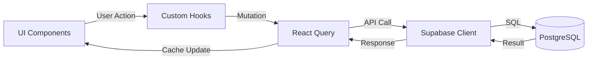
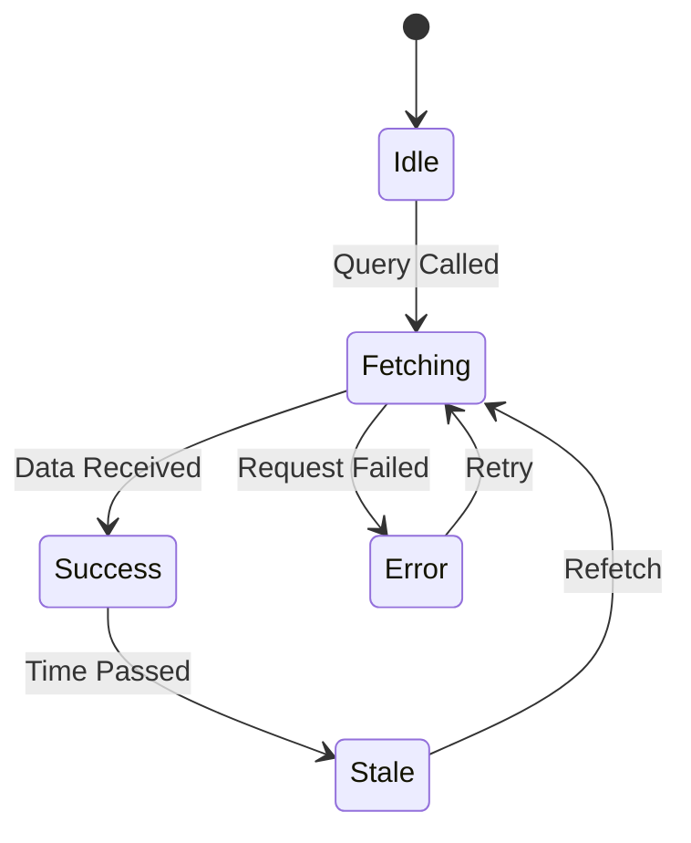
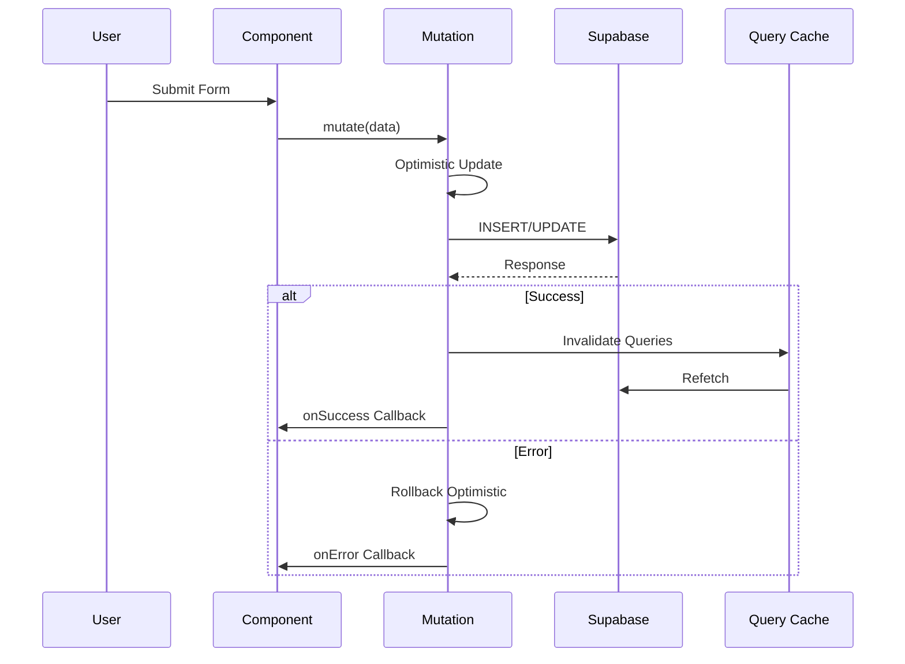
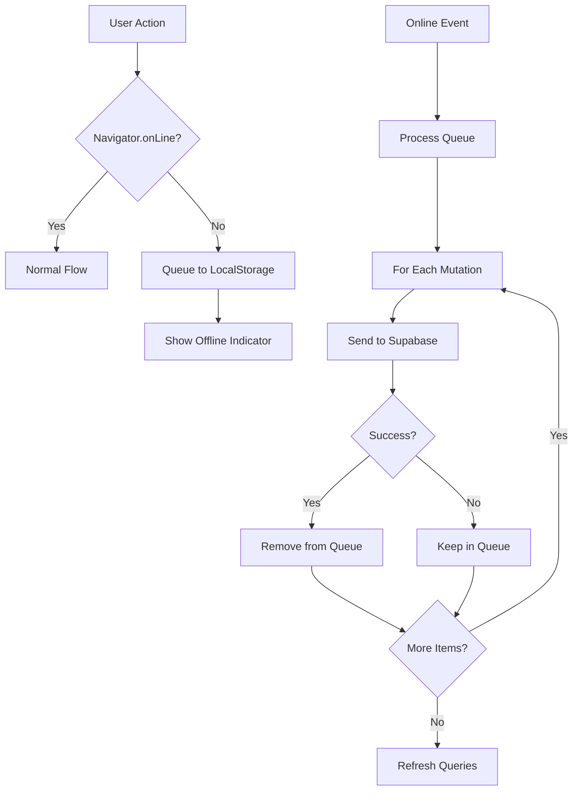
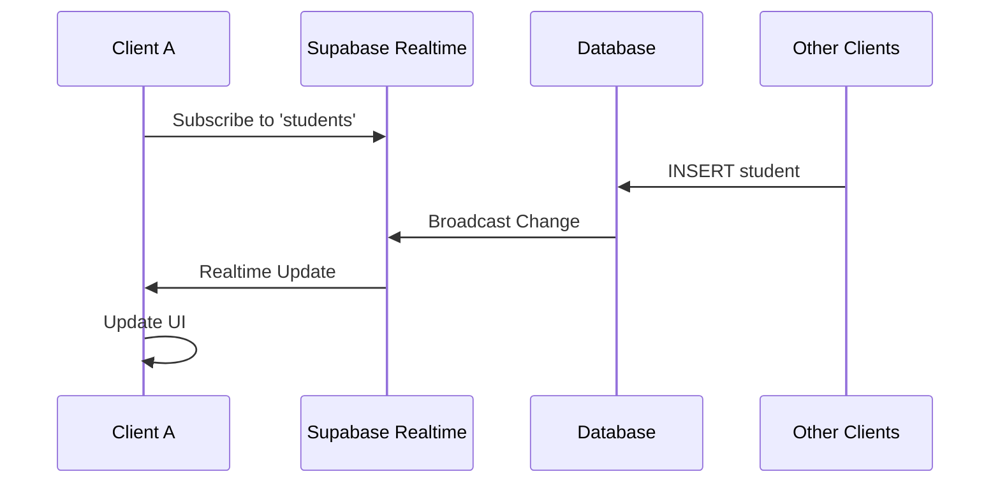
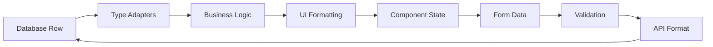

# Data Flow Architecture

## Overview

This document describes how data flows through the Portal Guru application, from user interactions to database persistence and back.

## Core Data Flow Pattern

Portal Guru uses a unidirectional data flow pattern with React Query as the central state management solution for server data.



## Query Flow (Read Operations)

### Fetching Data

1. Component mounts and calls custom hook (e.g., `useStudents`)
2. Hook uses `useQuery` from TanStack Query
3. Query checks cache for existing data
4. If cache is stale or empty, fetches from Supabase
5. Data is cached and returned to component

```typescript
// Example: Fetching students
const { data: students, isLoading, error } = useQuery({
    queryKey: ['students', userId],
    queryFn: async () => {
        const { data, error } = await supabase
            .from('students')
            .select('*, classes(name)')
            .eq('user_id', userId);
        if (error) throw error;
        return data;
    },
    staleTime: 5 * 60 * 1000, // 5 minutes
});
```

### Query Lifecycle



## Mutation Flow (Write Operations)

### Creating/Updating Data

1. User submits form or triggers action
2. Component calls mutation function
3. Optimistic update applied immediately (optional)
4. Request sent to Supabase
5. On success, cache is invalidated/updated
6. Related queries refetch automatically

```typescript
// Example: Adding a student
const { mutate: addStudent } = useMutation({
    mutationFn: async (newStudent) => {
        const { data, error } = await supabase
            .from('students')
            .insert(newStudent)
            .select()
            .single();
        if (error) throw error;
        return data;
    },
    onSuccess: () => {
        queryClient.invalidateQueries({ queryKey: ['students'] });
        toast.success('Siswa berhasil ditambahkan');
    },
    onError: (error) => {
        toast.error(`Gagal menambah siswa: ${error.message}`);
    },
});
```

### Mutation Lifecycle



## Offline Data Flow

When the application is offline, mutations are queued for later processing:



## Cache Invalidation Strategy

### Automatic Invalidation

React Query automatically handles cache invalidation based on query keys:

```typescript
// When a student is updated
onSuccess: () => {
    // Invalidates all queries that start with ['students']
    queryClient.invalidateQueries({ queryKey: ['students'] });
    
    // Also invalidate related data
    queryClient.invalidateQueries({ queryKey: ['attendance'] });
}
```

### Manual Cache Updates

For optimistic updates, we manually update the cache:

```typescript
// Optimistic update example
onMutate: async (newStudent) => {
    // Cancel outgoing refetches
    await queryClient.cancelQueries({ queryKey: ['students'] });
    
    // Snapshot previous value
    const previousStudents = queryClient.getQueryData(['students']);
    
    // Optimistically update
    queryClient.setQueryData(['students'], (old) => [...old, newStudent]);
    
    // Return context for rollback
    return { previousStudents };
},
onError: (err, newStudent, context) => {
    // Rollback on error
    queryClient.setQueryData(['students'], context.previousStudents);
},
```

## Real-time Data Sync

Portal Guru can optionally subscribe to real-time updates:



## Data Transformation Pipeline

Data often needs transformation between the database and UI:



## Related Documentation

- [Architecture Overview](./overview.md)
- [Offline Sync Strategy](./offline-sync.md)
- [API Documentation](../api/database/tables.md)
