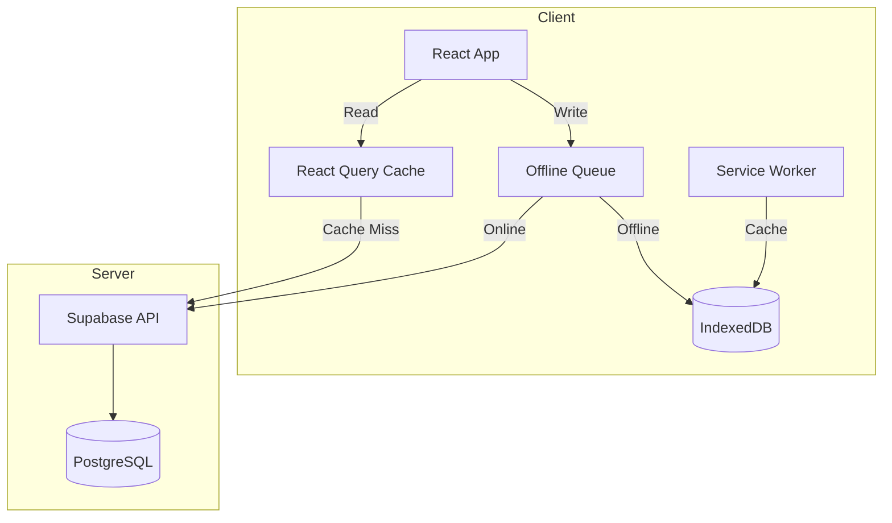
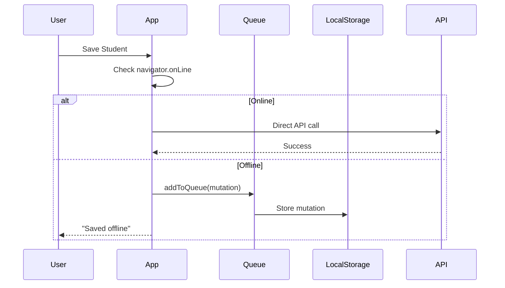
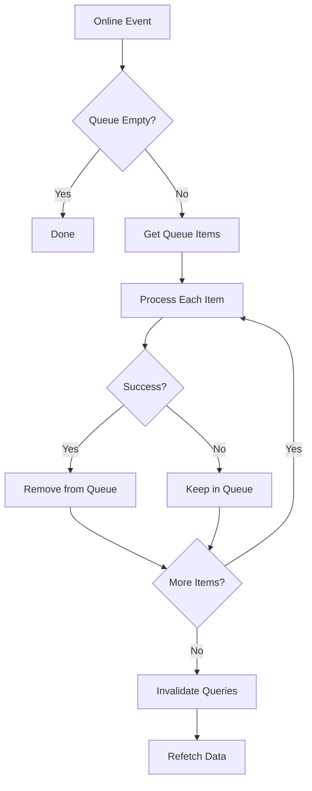

# Offline Sync Strategy

This document explains how Portal Guru handles offline functionality and data synchronization as a Progressive Web App (PWA).

## Table of Contents

1. [Overview](#overview)
2. [Service Worker](#service-worker)
3. [Offline Queue](#offline-queue)
4. [Sync Process](#sync-process)
5. [Conflict Resolution](#conflict-resolution)
6. [Implementation Details](#implementation-details)

---

## Overview

Portal Guru implements an **offline-first** architecture that allows teachers to:

- Access cached data when offline
- Make changes (CRUD operations) while offline
- Automatically sync changes when connectivity returns

### Architecture Diagram



---

## Service Worker

### Registration

The service worker is registered on app initialization:

```typescript
// src/hooks/useAuth.tsx
const setupServiceWorker = async () => {
    if ('serviceWorker' in navigator) {
        const registration = await navigator.serviceWorker.register('/sw.js');
        await navigator.serviceWorker.ready;
        return registration;
    }
    return null;
};
```

### Caching Strategy

| Resource Type | Strategy | TTL |
|--------------|----------|-----|
| Static assets (JS, CSS, images) | Cache First | 1 year |
| HTML pages | Network First | - |
| API responses | Stale While Revalidate | 5 min |
| Fonts | Cache First | 1 year |

### Cache Implementation

```javascript
// sw.js (simplified)
const CACHE_NAME = 'portal-guru-v1';
const STATIC_ASSETS = [
    '/',
    '/index.html',
    '/assets/main.js',
    '/assets/main.css',
    '/manifest.webmanifest'
];

// Install: Cache static assets
self.addEventListener('install', (event) => {
    event.waitUntil(
        caches.open(CACHE_NAME).then((cache) => {
            return cache.addAll(STATIC_ASSETS);
        })
    );
});

// Fetch: Network first, fallback to cache
self.addEventListener('fetch', (event) => {
    event.respondWith(
        fetch(event.request)
            .then((response) => {
                // Clone and cache successful responses
                const responseClone = response.clone();
                caches.open(CACHE_NAME).then((cache) => {
                    cache.put(event.request, responseClone);
                });
                return response;
            })
            .catch(() => {
                // Fallback to cache
                return caches.match(event.request);
            })
    );
});
```

---

## Offline Queue

### Queue Structure

Mutations made while offline are stored in localStorage:

```typescript
// src/services/offlineQueue.ts
export type QueuedMutation = {
    id: string;                    // Unique ID for deduplication
    table: string;                 // Target table
    operation: 'insert' | 'update' | 'delete' | 'upsert';
    payload: any;                  // Data to send
    onConflict?: string;           // Conflict resolution for upsert
    timestamp: number;             // Queue time for ordering
};
```

### Queue Operations

```typescript
// Add to queue
export const addToQueue = (mutation: Omit<QueuedMutation, 'id'>) => {
    const queue = getQueue();
    const newMutation: QueuedMutation = {
        ...mutation,
        id: `${Date.now()}-${Math.random()}`,
        timestamp: Date.now(),
    };
    queue.push(newMutation);
    localStorage.setItem(QUEUE_KEY, JSON.stringify(queue));
};

// Get queue
export const getQueue = (): QueuedMutation[] => {
    try {
        const queue = localStorage.getItem(QUEUE_KEY);
        return queue ? JSON.parse(queue) : [];
    } catch {
        return [];
    }
};

// Clear queue
export const clearQueue = () => {
    localStorage.removeItem(QUEUE_KEY);
};
```

### Queue Flow



---

## Sync Process

### Online Detection

```typescript
// src/hooks/useOfflineStatus.tsx
export const useOfflineStatus = () => {
    const [isOffline, setIsOffline] = useState(!navigator.onLine);

    useEffect(() => {
        const handleOnline = () => setIsOffline(false);
        const handleOffline = () => setIsOffline(true);

        window.addEventListener('online', handleOnline);
        window.addEventListener('offline', handleOffline);

        return () => {
            window.removeEventListener('online', handleOnline);
            window.removeEventListener('offline', handleOffline);
        };
    }, []);

    return isOffline;
};
```

### Sync Trigger

Sync is triggered when:
1. App detects online event
2. User manually triggers sync
3. App resumes from background

```typescript
// src/hooks/useSyncQueue.tsx
export const useSyncQueue = () => {
    const processQueue = async () => {
        const queue = getQueue();
        if (queue.length === 0) return;

        const results = [];
        for (const mutation of queue) {
            try {
                await processMutation(mutation);
                results.push({ id: mutation.id, success: true });
            } catch (error) {
                results.push({ id: mutation.id, success: false, error });
            }
        }

        // Remove successful mutations
        const failed = results.filter((r) => !r.success);
        if (failed.length === 0) {
            clearQueue();
        } else {
            // Keep only failed mutations
            const failedIds = failed.map((r) => r.id);
            const newQueue = queue.filter((m) => failedIds.includes(m.id));
            localStorage.setItem(QUEUE_KEY, JSON.stringify(newQueue));
        }

        // Invalidate React Query cache to refetch
        queryClient.invalidateQueries();
    };

    useEffect(() => {
        const handleOnline = () => {
            processQueue();
        };
        window.addEventListener('online', handleOnline);
        return () => window.removeEventListener('online', handleOnline);
    }, []);

    return { processQueue, pendingCount: getQueue().length };
};
```

### Sync Flow



---

## Conflict Resolution

### Strategy: Last Write Wins

Portal Guru uses a "last write wins" strategy for simplicity:

```typescript
// Using Supabase upsert with onConflict
await supabase
    .from('students')
    .upsert(studentData, { onConflict: 'id' });
```

### Merge Considerations

For future enhancement, consider:

| Strategy | Pros | Cons |
|----------|------|------|
| Last Write Wins | Simple | May lose data |
| First Write Wins | Preserves original | Ignores newer changes |
| Merge Fields | Keeps both changes | Complex logic |
| User Resolution | User decides | Interrupts workflow |

### Timestamp-Based Ordering

Queue mutations are processed in order:

```typescript
const sortedQueue = queue.sort((a, b) => a.timestamp - b.timestamp);
```

---

## Implementation Details

### React Query Integration

```typescript
// Optimistic updates with rollback
const { mutate } = useMutation({
    mutationFn: async (data) => {
        if (!navigator.onLine) {
            addToQueue({
                table: 'students',
                operation: 'update',
                payload: data,
            });
            return data; // Return optimistic result
        }
        
        const { data: result, error } = await supabase
            .from('students')
            .update(data)
            .eq('id', data.id)
            .select()
            .single();
        
        if (error) throw error;
        return result;
    },
    onMutate: async (newData) => {
        // Cancel outgoing refetches
        await queryClient.cancelQueries({ queryKey: ['students'] });
        
        // Snapshot previous value
        const previous = queryClient.getQueryData(['students']);
        
        // Optimistically update
        queryClient.setQueryData(['students'], (old) => 
            old.map((s) => s.id === newData.id ? { ...s, ...newData } : s)
        );
        
        return { previous };
    },
    onError: (err, newData, context) => {
        // Rollback on error
        queryClient.setQueryData(['students'], context.previous);
    },
});
```

### Offline Indicator

```tsx
// src/components/ui/OfflineIndicator.tsx
export const OfflineIndicator = () => {
    const isOffline = useOfflineStatus();
    const { pendingCount } = useSyncQueue();

    if (!isOffline && pendingCount === 0) return null;

    return (
        <div className="fixed bottom-4 right-4 bg-yellow-500 text-white px-4 py-2 rounded-lg">
            {isOffline ? (
                <span>📴 Anda sedang offline</span>
            ) : (
                <span>🔄 Menyinkronkan {pendingCount} perubahan...</span>
            )}
        </div>
    );
};
```

### Handling Large Datasets

For large amounts of data, consider:

1. **Pagination**: Only cache recent data
2. **Selective sync**: Only sync modified items
3. **Compression**: Compress queue data
4. **IndexedDB**: Use instead of localStorage for large data

```typescript
// Using IndexedDB for large data
import { openDB } from 'idb';

const db = await openDB('portal-guru', 1, {
    upgrade(db) {
        db.createObjectStore('offlineQueue', { keyPath: 'id' });
    },
});

await db.put('offlineQueue', mutation);
```

---

## Testing Offline Functionality

### Manual Testing

1. Open DevTools → Network tab
2. Set "Offline" checkbox
3. Perform CRUD operations
4. Disable "Offline"
5. Verify data syncs

### Automated Testing

```typescript
// Mock navigator.onLine
Object.defineProperty(navigator, 'onLine', {
    value: false,
    writable: true,
});

// Test offline queue
const mutation = {
    table: 'students',
    operation: 'insert',
    payload: { name: 'Test' },
};

addToQueue(mutation);
expect(getQueue()).toHaveLength(1);

// Simulate going online
Object.defineProperty(navigator, 'onLine', { value: true });
await processQueue();
expect(getQueue()).toHaveLength(0);
```

---

## Related Documentation

- [Architecture Overview](./overview.md)
- [Data Flow](./data-flow.md)
- [Service Worker API](https://developer.mozilla.org/en-US/docs/Web/API/Service_Worker_API)
