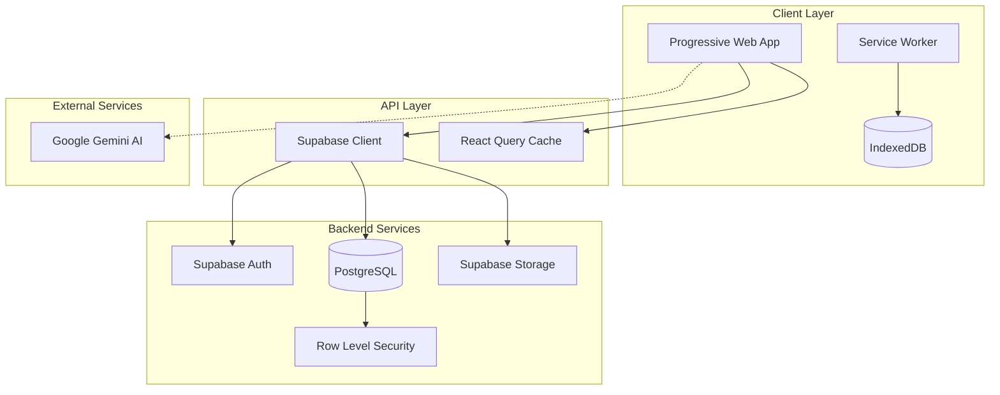
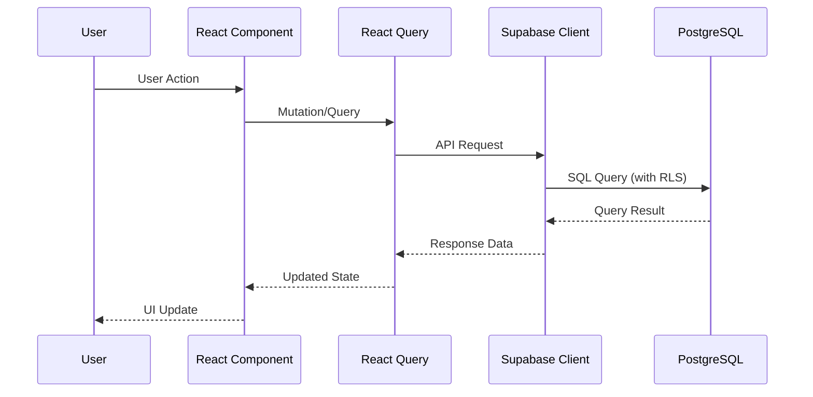
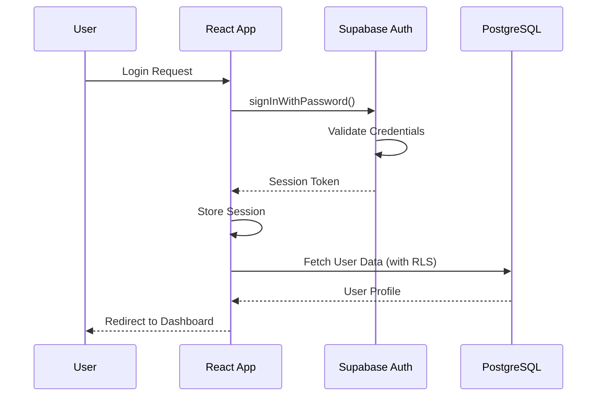
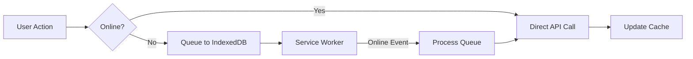
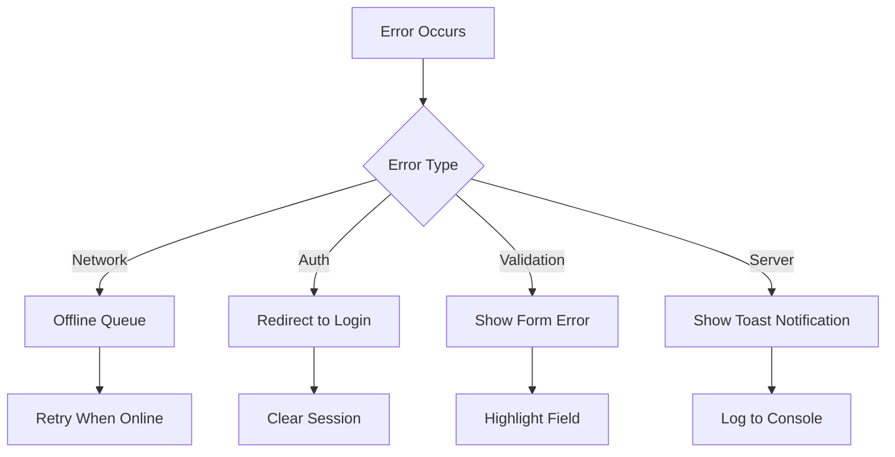
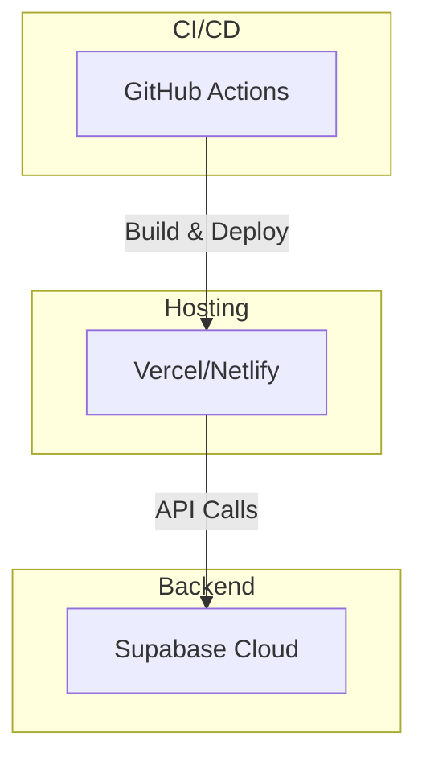

# Portal Guru - System Architecture Overview

## Introduction

Portal Guru is a Progressive Web Application (PWA) designed to help Indonesian teachers manage their classroom activities, including student management, attendance tracking, academic records, and parent communication. This document provides a comprehensive overview of the system architecture.

## Technology Stack

| Layer | Technology | Version |
|-------|------------|---------|
| **Frontend** | React | 18.x |
| **Build Tool** | Vite | 5.x |
| **Language** | TypeScript | 5.x |
| **Styling** | Tailwind CSS | 3.x |
| **State Management** | TanStack Query | 5.x |
| **Backend** | Supabase | Latest |
| **Database** | PostgreSQL | 15.x |
| **AI Integration** | Google Gemini | Latest |
| **PDF Generation** | jsPDF | 2.x |
| **PWA** | Vite PWA Plugin | 0.17.x |

## High-Level Architecture



## Component Architecture

### Frontend Structure

```
src/
├── components/
│   ├── pages/           # Page components (routed)
│   ├── ui/              # Reusable UI components
│   ├── skeletons/       # Loading state components
│   └── AdvancedFeatures.tsx  # Feature components
├── hooks/               # Custom React hooks
├── services/            # API and business logic
├── contexts/            # React context providers
├── utils/               # Utility functions
└── workers/             # Web Workers
```

### Key Components

| Component | Purpose |
|-----------|---------|
| `AuthProvider` | Manages user authentication state |
| `ThemeProvider` | Handles dark/light theme switching |
| `ToastProvider` | Displays notification toasts |
| `UndoToastProvider` | Manages undo functionality |
| `Layout` | Main application layout with navigation |

## Data Flow



## Authentication Flow



## Offline Sync Strategy

Portal Guru implements an offline-first approach:

1. **Service Worker**: Caches static assets and API responses
2. **IndexedDB**: Stores offline mutations in a queue
3. **Sync Queue**: Processes pending mutations when online
4. **React Query**: Provides optimistic updates and cache invalidation



## Security Architecture

### Row Level Security (RLS)

All database tables are protected by Row Level Security policies:

```sql
-- Example RLS Policy for students table
CREATE POLICY "Users can only see their own students"
ON students FOR SELECT
USING (user_id = auth.uid());

CREATE POLICY "Users can only insert their own students"
ON students FOR INSERT
WITH CHECK (user_id = auth.uid());
```

### Authentication

- **Method**: Email/Password authentication via Supabase Auth
- **Session**: JWT tokens with automatic refresh
- **Storage**: Secure session storage in browser

### Data Protection

- All API calls require valid authentication
- Sensitive data is encrypted in transit (HTTPS)
- User data is isolated at the database level via RLS

## Performance Optimizations

1. **Code Splitting**: Lazy loading of page components
2. **React Query Caching**: Intelligent cache with stale-while-revalidate
3. **Optimistic Updates**: Immediate UI feedback
4. **PWA Caching**: Offline-first with service worker
5. **Image Optimization**: Lazy loading and compression

## Error Handling



## Deployment Architecture



## Related Documentation

- [Data Flow Architecture](./data-flow.md)
- [Security Architecture](./security.md)
- [Offline Sync Strategy](./offline-sync.md)
- [Deployment Guide](../guides/deployment.md)
