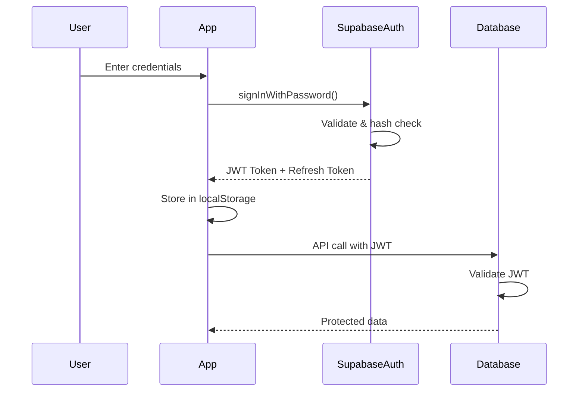
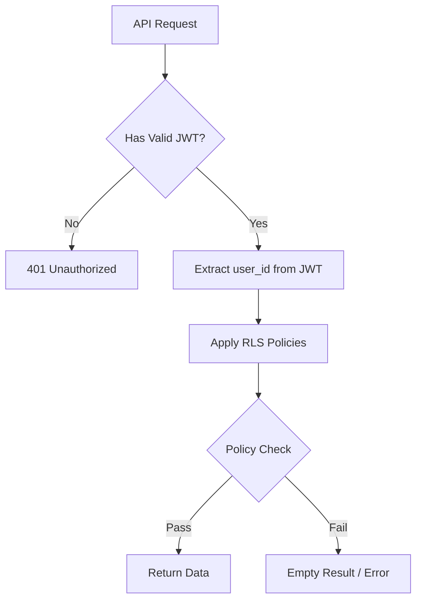

# Security Architecture

This document describes the security measures and best practices implemented in Portal Guru.

## Table of Contents

1. [Authentication](#authentication)
2. [Authorization](#authorization)
3. [Data Protection](#data-protection)
4. [API Security](#api-security)
5. [Client-Side Security](#client-side-security)
6. [Audit & Logging](#audit--logging)

---

## Authentication

### Overview

Portal Guru uses Supabase Auth for user authentication, which provides:

- Secure email/password authentication
- JWT-based session management
- Automatic token refresh
- Password hashing with bcrypt

### Authentication Flow



### Session Management

- **Access Token**: Short-lived JWT (1 hour default)
- **Refresh Token**: Long-lived token for obtaining new access tokens
- **Auto-refresh**: Supabase client automatically refreshes before expiry

```typescript
// Token refresh is automatic, but can be checked:
supabase.auth.onAuthStateChange((event, session) => {
    if (event === 'TOKEN_REFRESHED') {
        console.log('Token refreshed');
    }
});
```

### Password Requirements

- Minimum 6 characters (Supabase default)
- Stored using bcrypt hashing
- Never transmitted or stored in plain text

---

## Authorization

### Row Level Security (RLS)

All database tables have Row Level Security enabled, ensuring users can only access their own data.



### RLS Policy Examples

```sql
-- Users can only read their own students
CREATE POLICY "Users can view own students"
ON students FOR SELECT
USING (auth.uid() = user_id);

-- Users can only insert students with their own user_id
CREATE POLICY "Users can insert own students"
ON students FOR INSERT
WITH CHECK (auth.uid() = user_id);

-- Prevent modification of other users' data
CREATE POLICY "Users can update own students"
ON students FOR UPDATE
USING (auth.uid() = user_id)
WITH CHECK (auth.uid() = user_id);
```

### Role-Based Access

Currently, Portal Guru implements a single-role system (teacher). Future enhancements may include:

- Admin role for school administrators
- Parent role with read-only access
- Student role with limited access

---

## Data Protection

### Encryption

| Layer | Method |
|-------|--------|
| In Transit | HTTPS/TLS 1.3 |
| At Rest | PostgreSQL encryption |
| Passwords | bcrypt hashing |
| Sensitive Data | Supabase Vault (optional) |

### HTTPS Enforcement

All communication uses HTTPS:

```javascript
// Supabase client automatically uses HTTPS
const supabaseUrl = 'https://xxxxx.supabase.co';
```

### Data Sanitization

Input data is sanitized to prevent injection attacks:

```typescript
// Using DOMPurify for HTML content
import DOMPurify from 'dompurify';

const sanitizedInput = DOMPurify.sanitize(userInput);
```

---

## API Security

### Rate Limiting

Supabase implements rate limiting by default:

- 5000 requests per minute (default)
- Configurable per project

### CORS Configuration

CORS is configured in Supabase to allow only trusted origins:

```
Allowed Origins:
- https://portal-guru.vercel.app
- http://localhost:5173 (development)
```

### SQL Injection Prevention

Using Supabase client with parameterized queries:

```typescript
// ✅ Safe - parameterized
const { data } = await supabase
    .from('students')
    .select('*')
    .eq('id', studentId);

// ❌ Dangerous - raw SQL (avoid)
// const { data } = await supabase.rpc('unsafe_query', { input: userInput });
```

---

## Client-Side Security

### XSS Prevention

1. **React's built-in escaping**: JSX automatically escapes values
2. **Content Security Policy**: Restricts script sources
3. **DOMPurify**: Sanitizes any dynamic HTML

```tsx
// React automatically escapes
<div>{userInput}</div>  // Safe

// Use DOMPurify for dangerouslySetInnerHTML
<div dangerouslySetInnerHTML={{ __html: DOMPurify.sanitize(html) }} />
```

### CSRF Protection

- JWT tokens are used instead of cookies for authentication
- No CSRF vulnerability since we don't rely on cookie-based auth

### Local Storage Security

Sensitive data handling:

```typescript
// Access tokens are stored in localStorage by Supabase
// For enhanced security, consider:
// 1. Short token expiry times
// 2. Automatic logout on inactivity
// 3. Clear storage on logout
```

### Service Worker Security

```javascript
// sw.js - Only cache safe resources
self.addEventListener('install', (event) => {
    event.waitUntil(
        caches.open(CACHE_NAME).then((cache) => {
            return cache.addAll([
                '/index.html',
                '/assets/main.js',
                // Only public, non-sensitive resources
            ]);
        })
    );
});
```

---

## Audit & Logging

### Action History

Portal Guru tracks user actions for audit purposes:

```sql
-- action_history table structure
CREATE TABLE action_history (
    id UUID PRIMARY KEY,
    user_id UUID NOT NULL,
    action_type TEXT NOT NULL,
    entity_type TEXT NOT NULL,
    affected_ids TEXT[],
    created_at TIMESTAMPTZ DEFAULT NOW()
);
```

### Client-Side Logging

```typescript
// Using custom logger service
import { logger } from './services/logger';

logger.info('User logged in', { userId: user.id });
logger.error('API call failed', { error, endpoint });
```

### Recommended Monitoring

| Tool | Purpose |
|------|---------|
| Sentry | Error tracking |
| Supabase Logs | API and database logs |
| LogRocket | Session replay (optional) |

---

## Security Best Practices

### For Developers

1. **Never commit secrets** - Use environment variables
2. **Validate all inputs** - Both client and server side
3. **Use TypeScript** - Catch type-related bugs early
4. **Keep dependencies updated** - Regular `npm audit`
5. **Follow least privilege** - Request minimal permissions

### For Deployment

1. **Enable HTTPS** - Required for production
2. **Set secure headers** - CSP, X-Frame-Options, etc.
3. **Regular backups** - Use Supabase automatic backups
4. **Monitor for anomalies** - Set up alerts

### Security Headers

Recommended headers (configure in hosting platform):

```
Content-Security-Policy: default-src 'self'; script-src 'self' 'unsafe-inline'
X-Frame-Options: DENY
X-Content-Type-Options: nosniff
Referrer-Policy: strict-origin-when-cross-origin
Permissions-Policy: camera=(), microphone=(), geolocation=()
```

---

## Related Documentation

- [Architecture Overview](./overview.md)
- [Deployment Guide](../guides/deployment.md)
- [Database Schema](../api/database/tables.md)
