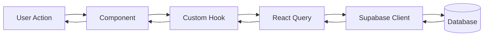

# Getting Started with Portal Guru

Selamat datang di Portal Guru! Panduan ini akan membantu Anda memulai pengembangan aplikasi dengan cepat.

## Table of Contents

1. [Prerequisites](#prerequisites)
2. [Quick Start](#quick-start)
3. [Project Overview](#project-overview)
4. [First Tasks for New Contributors](#first-tasks-for-new-contributors)
5. [Understanding the Codebase](#understanding-the-codebase)
6. [Common Workflows](#common-workflows)
7. [Resources](#resources)

---

## Prerequisites

### System Requirements

| Requirement | Version | Check Command |
|-------------|---------|---------------|
| Node.js | >= 18.0.0 | `node --version` |
| npm | >= 9.0.0 | `npm --version` |
| Git | >= 2.40.0 | `git --version` |

### Recommended Tools

- **Code Editor**: [VS Code](https://code.visualstudio.com/)
- **Browser**: Chrome or Edge (untuk DevTools terbaik)
- **Git Client**: Git CLI atau [GitHub Desktop](https://desktop.github.com/)

### VS Code Extensions

Install extensions berikut untuk pengalaman development terbaik:

1. **ESLint** - Linting JavaScript/TypeScript
2. **Prettier** - Code formatting
3. **TypeScript and JavaScript Language Features** (built-in)
4. **Tailwind CSS IntelliSense** - Autocomplete Tailwind classes
5. **Error Lens** - Inline error display

---

## Quick Start

### Step 1: Clone Repository

```bash
git clone https://github.com/your-org/portal-guru.git
cd portal-guru
```

### Step 2: Install Dependencies

```bash
npm install
```

### Step 3: Setup Environment

Buat file `.env.local` di root folder:

```env
VITE_SUPABASE_URL=your_supabase_url
VITE_SUPABASE_ANON_KEY=your_supabase_anon_key
```

> 📝 **Note**: Hubungi maintainer untuk mendapatkan credentials development, atau buat Supabase project sendiri.

### Step 4: Start Development Server

```bash
npm run dev
```

Buka browser dan akses `http://localhost:5173`

### Step 5: Verify Setup

1. ✅ Halaman login muncul
2. ✅ Bisa login dengan akun test
3. ✅ Dashboard menampilkan data

🎉 **Selamat!** Anda siap untuk mulai development!

---

## Project Overview

### Apa itu Portal Guru?

Portal Guru adalah aplikasi web (PWA) untuk guru Indonesia yang membantu mengelola:

- 👨‍🎓 **Siswa** - Data siswa dan kelas
- 📋 **Absensi** - Kehadiran harian
- 📊 **Nilai** - Rekam akademik
- 📝 **Laporan** - Generate laporan PDF
- 🎮 **Gamifikasi** - Badge dan leaderboard
- 👪 **Portal Orang Tua** - Akses untuk wali murid

### Tech Stack

```
Frontend: React 18 + TypeScript + Vite
Styling: Tailwind CSS
State: TanStack Query (React Query)
Backend: Supabase (PostgreSQL + Auth + Storage)
PWA: Vite PWA Plugin
```

### Folder Structure

```
portal-guru/
├── src/
│   ├── components/
│   │   ├── pages/        # 📄 Halaman/routes
│   │   ├── ui/           # 🎨 Komponen UI reusable
│   │   └── skeletons/    # ⏳ Loading states
│   ├── hooks/            # 🪝 Custom React hooks
│   ├── services/         # 🔌 API & business logic
│   ├── contexts/         # 📦 React contexts
│   ├── utils/            # 🔧 Utility functions
│   └── workers/          # ⚙️ Web Workers
├── docs/                 # 📚 Documentation
├── public/               # 🖼️ Static assets
└── tests/                # 🧪 Test files
```

---

## First Tasks for New Contributors

Berikut beberapa task yang cocok untuk memulai:

### 🟢 Good First Issues

1. **Fix typos in UI text**
   - Cari text yang typo di komponen
   - Submit PR dengan fix

2. **Add missing translations**
   - Cari text hardcoded bahasa Inggris
   - Ganti ke bahasa Indonesia

3. **Improve loading states**
   - Tambahkan skeleton loading ke komponen
   - Gunakan komponen dari `src/components/skeletons/`

4. **Add tooltips**
   - Tambahkan tooltip ke icon buttons
   - Gunakan komponen Tooltip yang ada

### 🟡 Medium Tasks

1. **Write unit tests**
   - Pilih service atau utility tanpa test
   - Tulis test dengan Vitest

2. **Improve accessibility**
   - Tambahkan ARIA labels
   - Perbaiki keyboard navigation

3. **Add JSDoc comments**
   - Dokumentasikan fungsi public
   - Lihat contoh di `src/services/`

### 🔴 Advanced Tasks

1. **Optimize performance**
   - Profiling dengan React DevTools
   - Implement memoization

2. **Add new feature**
   - Diskusi dengan maintainer dulu
   - Follow contributing guidelines

---

## Understanding the Codebase

### Data Flow



### Key Files to Understand

| File | Purpose |
|------|---------|
| `src/App.tsx` | Main app with routing |
| `src/services/supabase.ts` | Supabase client config |
| `src/hooks/useAuth.tsx` | Authentication logic |
| `src/components/Layout.tsx` | Main layout with navigation |

### How Authentication Works

1. User logs in via `supabase.auth.signInWithPassword()`
2. Supabase returns JWT token
3. Token stored in browser storage
4. All API calls include token automatically
5. Database uses RLS to filter by `user_id`

### How Data Fetching Works

```typescript
// Example: Fetching students
const { data, isLoading, error } = useQuery({
    queryKey: ['students'],
    queryFn: async () => {
        const { data, error } = await supabase
            .from('students')
            .select('*');
        if (error) throw error;
        return data;
    }
});
```

---

## Common Workflows

### Adding a New Page

1. Create component in `src/components/pages/NewPage.tsx`
2. Add route in `src/App.tsx`
3. Add navigation link in `src/components/Layout.tsx`

### Adding a New UI Component

1. Create in `src/components/ui/NewComponent.tsx`
2. Add JSDoc documentation
3. Create Storybook story (optional)
4. Export from component

### Making API Calls

```typescript
// Read data
const { data } = await supabase.from('table').select('*');

// Insert data
await supabase.from('table').insert({ ... });

// Update data
await supabase.from('table').update({ ... }).eq('id', id);

// Delete data
await supabase.from('table').delete().eq('id', id);
```

### Running Tests

```bash
# Run all tests
npm run test

# Run tests in watch mode
npm run test:watch

# Run specific test file
npm run test -- path/to/test.ts
```

---

## Resources

### Documentation

- [Architecture Overview](../architecture/overview.md)
- [Contributing Guide](./contributing.md)
- [API Documentation](../api/)
- [Troubleshooting](./troubleshooting.md)

### External Resources

- [React Documentation](https://react.dev/)
- [TypeScript Handbook](https://www.typescriptlang.org/docs/)
- [Tailwind CSS](https://tailwindcss.com/docs)
- [TanStack Query](https://tanstack.com/query/latest)
- [Supabase Docs](https://supabase.com/docs)

### Getting Help

1. **Search existing issues** di GitHub
2. **Ask in Discord** (jika ada)
3. **Create issue** dengan detail pertanyaan
4. **Contact maintainers** via email

---

## Next Steps

Setelah setup berhasil:

1. 📖 Baca [Contributing Guide](./contributing.md)
2. 🔍 Explore codebase dengan membuka beberapa file
3. 🎯 Pilih task dari [Good First Issues](#first-tasks-for-new-contributors)
4. 💬 Perkenalkan diri di issue/discussion

**Happy coding!** 🚀
