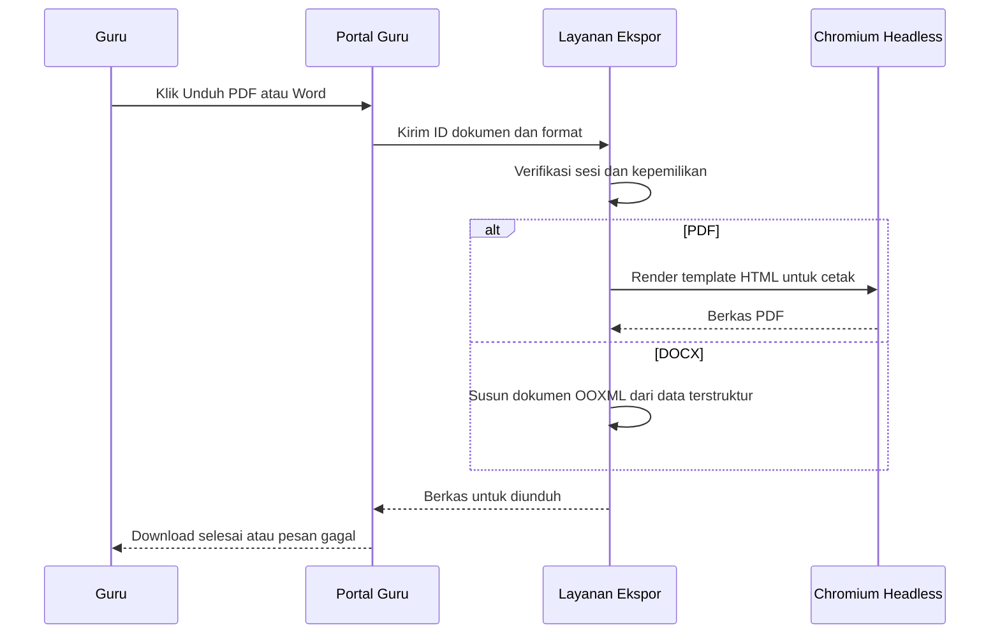

# PRD — Ekspor Dokumen Modul Ajar Produksi

**Status:** Fase 1 diimplementasikan di balik feature flag ([catatan implementasi](./modul-ajar-ekspor-dokumen.md))  
**Pemilik:** Portal Guru  
**Target:** Modul Ajar dan RPP  
**Tanggal:** 2 Oktober 2026

## 1. Ringkasan

Guru membutuhkan hasil Modul Ajar yang siap dicetak, dibagikan, dan diedit tanpa isi hilang, halaman kosong, teks terpotong, atau tata letak yang berubah antarperangkat.

Fitur ini mengganti ekspor PDF berbasis tangkapan layar di browser dan ekspor Word berbasis HTML `.doc` dengan dua output formal:

- PDF dihasilkan oleh Chromium headless pada server Vercel.
- Word dihasilkan sebagai berkas `.docx` asli menggunakan paket `docx` yang sudah tersedia di project.

## 2. Masalah yang Diselesaikan

| Masalah saat ini | Dampak bagi guru |
| --- | --- |
| Rasterisasi HTML di browser dapat menghasilkan halaman putih atau memotong sisi dokumen. | Dokumen tidak bisa dipakai untuk administrasi. |
| Format `.doc` berisi HTML tidak selalu konsisten di Microsoft Word. | Tata letak dan page break berubah saat dibuka. |
| Logika PDF dan Word mengambil isi dari jalur yang berbeda. | Hasil ekspor bisa tidak sama dengan pratinjau. |
| Ukuran A4/F4 dan margin belum diuji lewat mesin cetak yang sama. | Hasil tidak konsisten antarperangkat. |

## 3. Tujuan dan Metrik Keberhasilan

### Tujuan

1. Guru memperoleh PDF yang sama dengan template Modul Ajar, dengan teks lengkap dan margin cetak konsisten.
2. Guru memperoleh `.docx` yang dapat diedit di Microsoft Word tanpa konversi tambahan.
3. Ekspor dari pratinjau dan riwayat memakai data dokumen yang sama.

### Metrik

| Metrik | Target peluncuran |
| --- | --- |
| PDF tanpa halaman kosong atau potongan horizontal pada suite sampel | 100% |
| Pembukaan `.docx` di Microsoft Word dan LibreOffice | 100% sampel lulus |
| Waktu pembuatan PDF Modul Ajar sampai 15 halaman | p95 ≤ 12 detik |
| Ekspor gagal yang menampilkan pesan jelas dan dapat dicoba ulang | 100% |

## 4. Pengguna dan Alur

**Pengguna utama:** Guru penyusun Modul Ajar atau RPP.



## 5. Kebutuhan Fungsional

### 5.1 Sumber dokumen

- Tombol PDF dan Word tersedia pada pratinjau serta setiap item riwayat.
- Sistem mengambil dokumen tersimpan berdasarkan `lesson_plan.id`; klien tidak mengirim HTML mentah sebagai sumber otoritatif.
- Guru hanya dapat mengekspor dokumen miliknya. Admin mengikuti kebijakan akses yang telah ada.
- Perubahan di pratinjau guru disimpan ke draf sebelum ekspor atau guru menerima pesan bahwa perubahan belum disimpan.

### 5.2 PDF

- Endpoint `POST /api/document-export/pdf` menerima `lessonPlanId` dan `paperSize`.
- Server mengambil data, merender template cetak khusus, menunggu font selesai dimuat, lalu menjalankan `page.pdf()` Chromium.
- Mendukung A4 dan F4, orientasi potret, margin 2 cm, warna latar tabel, header, footer, dan page break CSS.
- Header tabel dapat berulang pada halaman baru; baris tabel dan blok tanda tangan tidak terbelah.
- Nama file: `Modul_Ajar_{mapel}_Kelas{kelas}.pdf` dengan sanitasi karakter ilegal.

### 5.3 Word

- Tombol Word menghasilkan ekstensi `.docx` dan MIME type Office Open XML.
- Generator menggunakan model data Modul Ajar terstruktur, bukan konversi HTML generik.
- Mendukung halaman A4/F4, margin, judul, tabel identitas, tabel kegiatan, daftar, rubrik, dan blok tanda tangan.
- Nama file: `Modul_Ajar_{mapel}_Kelas{kelas}.docx`.
- Berkas dapat dibuka di Microsoft Word dan LibreOffice tanpa peringatan format.

### 5.4 Status dan kegagalan

- Tombol yang sedang memproses berubah menjadi loading dan tidak dapat diklik ulang.
- Kegagalan jaringan, otorisasi, data tidak ditemukan, timeout, dan kegagalan renderer mempunyai pesan berbeda serta tombol coba lagi.
- Permintaan ekspor tidak menyimpan data baru kecuali guru memilih menyimpan draf.

## 6. Bukan Cakupan

- Mengubah isi pedagogis yang dihasilkan AI.
- Membuat editor Word di dalam aplikasi.
- Mengganti ekspor PDF modul lain seperti absensi, Prota, atau Promes.
- Menyediakan template dengan logo sekolah yang dapat diubah pengguna pada fase ini.

## 7. Keputusan Teknis

| Area | Keputusan |
| --- | --- |
| PDF | Vercel Serverless Function + `puppeteer-core` + Chromium yang kompatibel serverless. |
| Word | Generator `.docx` berbasis paket `docx` yang sudah dipakai oleh `src/utils/exportPerangkatAjar.ts`. |
| Template | Satu model data Modul Ajar; template HTML cetak untuk PDF dan builder OOXML untuk Word. |
| Otorisasi | Endpoint memakai pola `api/_auth.ts`, lalu memeriksa pemilik `lesson_plans.user_id`. |
| Keamanan | Server memuat data dari database; HTML untuk PDF disanitasi; endpoint memiliki batas ukuran dan rate limit. |
| Penyimpanan | Berkas dikirim langsung sebagai respons. Penyimpanan berkas dan tautan permanen tidak termasuk fase pertama. |

## 8. API Kontrak

### Permintaan PDF

```json
POST /api/document-export/pdf
{
  "lessonPlanId": "uuid",
  "paperSize": "A4"
}
```

Respons sukses: `application/pdf` dengan `Content-Disposition: attachment`.

### Permintaan Word

```json
POST /api/document-export/docx
{
  "lessonPlanId": "uuid",
  "paperSize": "F4"
}
```

Respons sukses: `application/vnd.openxmlformats-officedocument.wordprocessingml.document` dengan `Content-Disposition: attachment`.

## 9. Rencana Implementasi

1. Definisikan tipe `LessonPlanExportData` dan mapper dari `lesson_plans`.
2. Pisahkan template cetak Modul Ajar dari komponen UI; tambahkan CSS `@page` untuk A4 dan F4.
3. Buat fungsi Vercel PDF dengan autentikasi, pemeriksaan kepemilikan, renderer Chromium, timeout, dan audit log.
4. Buat `modulAjarDocxExport.ts` dengan pola `docx` yang sama seperti exporter Prota/Promes.
5. Ubah tombol pratinjau dan riwayat agar memakai layanan ekspor baru serta status loading.
6. Pertahankan cetak browser sebagai fallback sementara endpoint PDF belum tersedia.
7. Hapus jalur `html2canvas` setelah produksi stabil.

## 10. Pengujian dan Kriteria Penerimaan

| Skenario | Kriteria penerimaan |
| --- | --- |
| Modul Ajar 1 halaman | PDF A4 utuh, teks tidak terpotong, margin terlihat. |
| Modul Ajar 15 halaman | Nomor halaman benar, tidak ada halaman putih, tabel dan tanda tangan tidak terpecah. |
| F4 | Tinggi halaman F4 dan margin sesuai template. |
| Pratinjau siswa | PDF hanya memuat konten yang ditujukan untuk siswa. |
| Riwayat | PDF/Word memakai data dan ukuran kertas dokumen tersimpan. |
| Word | `.docx` terbuka di Word dan LibreOffice, tabel identitas serta rubrik terbaca. |
| Otorisasi | Pengguna tidak dapat mengekspor `lessonPlanId` milik pengguna lain. |
| Kegagalan renderer | UI menampilkan pesan gagal dan guru dapat mencoba ulang. |

## 11. Risiko dan Mitigasi

| Risiko | Mitigasi |
| --- | --- |
| Chromium memperbesar ukuran deployment atau cold start. | Gunakan Chromium serverless, batasi concurrency, dan ukur p95 pada preview Vercel. |
| Dokumen sangat panjang melebihi timeout. | Batasi ukuran input, gunakan timeout terkontrol, dan tampilkan opsi cetak browser. |
| PDF dan Word berbeda secara visual. | Gunakan data model yang sama dan snapshot test untuk sampel resmi. |
| Edit pratinjau belum tersimpan. | Tampilkan status perubahan dan simpan draf sebelum meminta ekspor. |

## 12. Rollout

1. Rilis endpoint dan export `.docx` di preview Vercel.
2. Jalankan suite sampel A4/F4 untuk Modul Ajar, RPP, KBC, tabel panjang, dan LKPD siswa.
3. Aktifkan feature flag untuk pengguna internal.
4. Pantau kegagalan ekspor dan durasi selama 7 hari.
5. Aktifkan untuk semua guru, lalu hapus ekspor PDF raster setelah metrik stabil.
